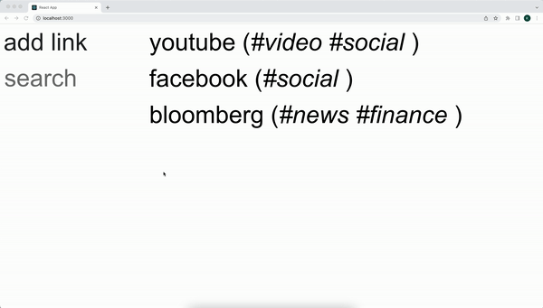
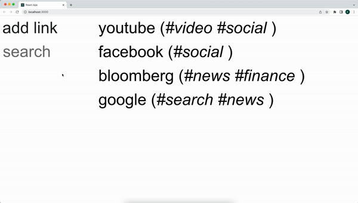
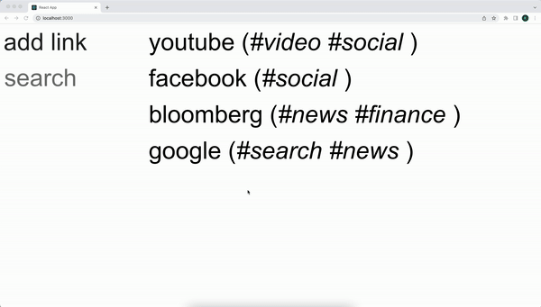

# Link Share
This project uses react to build an application that allows a user to store links to websites using local browser storage. Additional features allow the user to search through stored links.

# Functionality

## Installation
1. Clone the repository
2. Open terminal and change directory to the cloned repository
3. Type "yarn add" + enter
4. Type "yarn start" + enter

## Help
- "ADD LINK" to add a new link
- "SEARCH" to search
- Click a link to open link in new page

